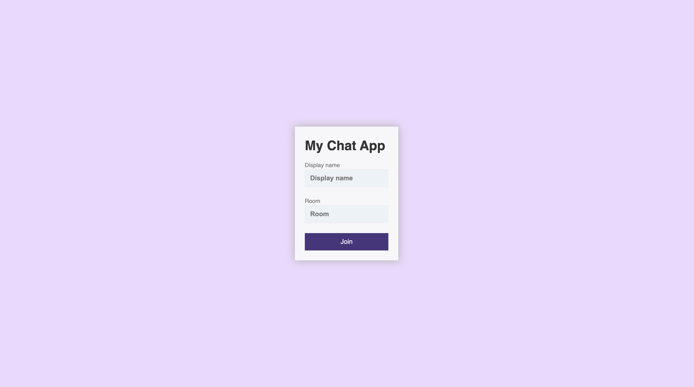
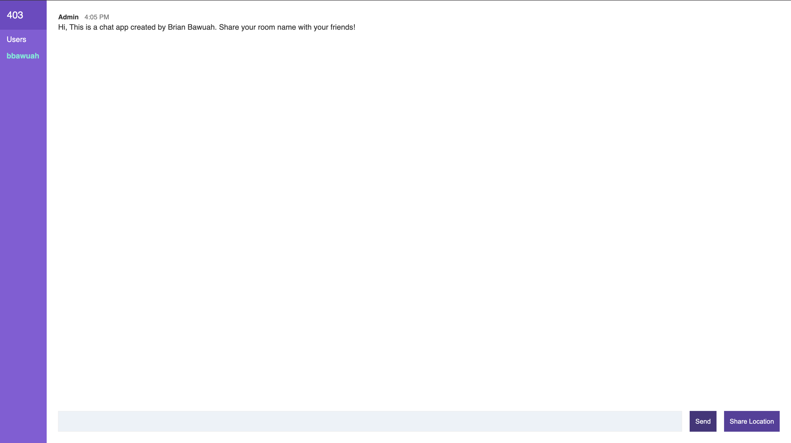

With this chat application users can communicate with each other in rooms.



<p>
You can view the code of the server <a href="https://github.com/bbawuah/chat-app/"  target="__blank">here</a>. 
</p>
<p>
You can view the project <a href="https://bawuah-chatapp.herokuapp.com/"  target="__blank">here</a>. 
</p>

<h3>Concept</h3>
<p>The application is built with Handlebars, Node.js and Socket.IO
</p>



<h3>Server</h3>

```javascript
const http = require('http')
const path = require('path')
const express = require('express')
const socketio = require('socket.io')
const Filter = require('bad-words')
const { generateMessage, generateLocationMessage } = require('./utils/messages')
const {
  addUser,
  removeUser,
  getUser,
  getUsersInRoom
} = require('./utils/users')

/*
Refactoring because express creates own server behind the scenes
Socket io expects to be called with the raw http server.
*/
const app = express()
const server = http.createServer(app)
const io = socketio(server)

const port = process.env.PORT || 3000
const publicDirectoryPath = path.join(__dirname, '../public')

app.use(express.static(publicDirectoryPath))

//server (emit) -> client (receive) - countUpdated
// client (emit) -> server (receive) - increment

io.on('connection', (socket) => {
  console.log('New Websocket connection')

  socket.on('join', ({ username, room }, callback) => {
    const { error, user } = addUser({ id: socket.id, username, room })

    if (error) {
      return callback(error)
    }

    socket.join(user.room)

    socket.emit(
      'message',
      generateMessage(
        'Admin',
        'Hi, This is a chat app created by Brian Bawuah. Share your room name with your friends!'
      )
    )
    socket.broadcast
      .to(user.room)
      .emit('message', generateMessage('Admin', `${user.username} has joined!`))
    io.to(user.room).emit('roomData', {
      room: user.room,
      users: getUsersInRoom(user.room)
    })

    callback()
  })

  socket.on('sendMessage', (msg, callback) => {
    const user = getUser(socket.id)

    const filter = new Filter()

    if (filter.isProfane(msg)) {
      return callback('Profanity is not allowed!')
    }

    io.to(user.room).emit('message', generateMessage(user.username, msg))
    callback()
  })

  socket.on('disconnect', () => {
    const user = removeUser(socket.id)

    if (user) {
      io.to(user.room).emit(
        'message',
        generateMessage('Admin', `${user.username} has left.`)
      )
      io.to(user.room).emit('roomData', {
        room: user.room,
        users: getUsersInRoom(user.room)
      })
    }
  })

  socket.on('sendLocation', (data, callback) => {
    const user = getUser(socket.id)

    io.to(user.room).emit(
      'locationMessage',
      generateLocationMessage(
        user.username,
        `https://google.com/maps?q=${data.lat},${data.long}`
      )
    )
    callback()
  })
})

server.listen(port, () => {
  console.log('App is listening to port 3000')
})
```

<h4>Users</h4>

```javascript
const users = []

// addUser, removeUser, getUser, getUsersInRoom

const addUser = ({ id, username, room }) => {
  // Clean the data

  username = username.trim().toLowerCase()
  room = room.trim().toLowerCase()

  // Validate the data
  if (!username || !room) {
    return {
      error: 'Username and room are required!'
    }
  }

  // Check for existing user

  const existingUser = users.find((user) => {
    return user.room === room && user.username === username
  })

  // Validate username

  if (existingUser) {
    return {
      error: 'Username is in use!'
    }
  }

  // Store User
  const user = { id, username, room }
  users.push(user)
  return { user }
}

// remove user
const removeUser = (id) => {
  const index = users.findIndex((user) => user.id === id)

  if (index !== -1) {
    return users.splice(index, 1)[0]
  }
}

// Get user
const getUser = (id) => {
  return users.find((user) => user.id === id)
}

const getUsersInRoom = (room) => {
  room = room.trim().toLowerCase()
  return users.filter((user) => user.room === room)
}

module.exports = {
  addUser,
  removeUser,
  getUser,
  getUsersInRoom
}
```

<h4>Messages</h4>

```javascript
const generateMessage = (username, text) => {
  return {
    username,
    text,
    createdAt: new Date().getTime()
  }
}

const generateLocationMessage = (username, url) => {
  return {
    username,
    url,
    createdAt: new Date().getTime()
  }
}

module.exports = {
  generateMessage,
  generateLocationMessage
}
```

<h3>Wanna know more? Let's chat!</h3>
<p>These are just some code snippets. Do you know more about this app? Send me a message! I would love to talk code and learn from others :)</p>

<p>Thanks for reading!</p>
