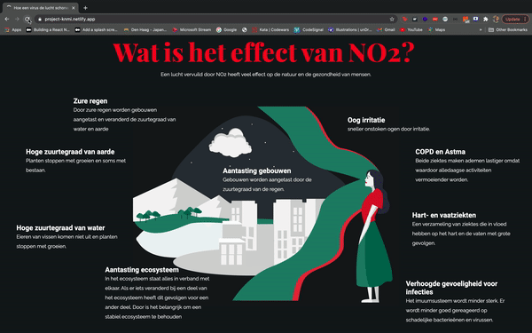
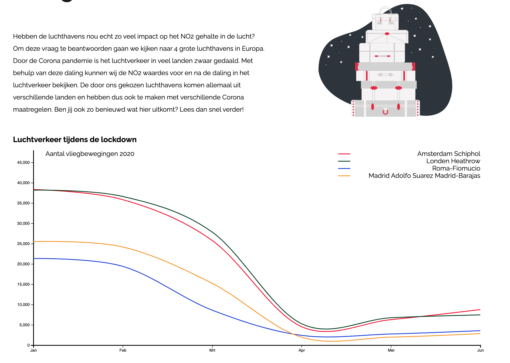
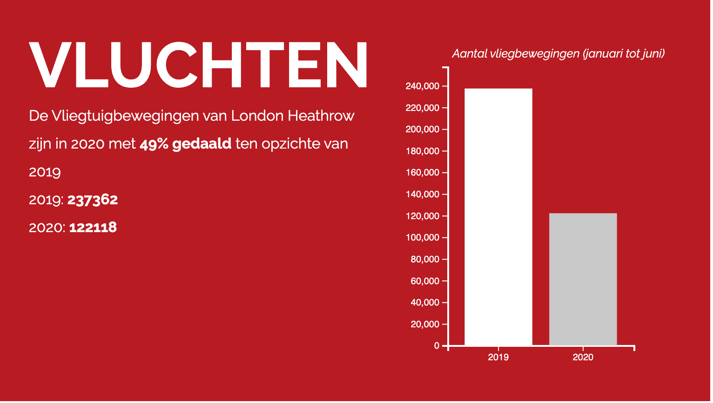

This assignment is about creating an interactive insight into cause and effect, so that policymakers and the general public better understand how changing collective behavior can reduce air pollution. To be able to research and visualize this, we need data. We get this data from a satellite instrument, the Tropomi, which looks at the atmosphere of our earth with the best cameras available. We will use this data to make comparisons that are of interest to the target group. Future measures can be mapped out from these comparisons.


<p>
You can view the code of the frontend <a href="https://github.com/bbawuah/project-knmi"  target="__blank">here</a>. 
</p>
<p>
You can view the project <a href="https://project-knmi.netlify.app/"  target="__blank">here</a>. 
</p>

<strong>_The project is only built for desktop applications_</strong>

<h3>Concept</h3>
<p>
In our application we want to see what consequences the Corona virus and the associated measures have on the substances in the air. We focused here on NO2, nitrogen dioxide. We can read these NO2 values ​​using the Tropomi satellite of the KNMI. We also looked at the measures taken by a number of countries and cities. We eventually made a selection of 4 cities, Amsterdam, London, Rome and Madrid.

</p>
<p>
All these cities have a 'large' airport. What kind of influence does the Corona virus actually have on these airports? Each city has different measures that affect the number of flight movements. We want to use a number of datasets to find out what has changed in the number of flight movements. We want to compare this change with the change in the NO2 content in the air.

</p>
<br/>
<h3>Google Earth Engine </h3>
<p>
To set up the Google Earth Engine, we set up a server with a route that returns a mapId. This is because authentication and security was quite a thing in Javascript.
</p>

<p>
You can view the code of the server  <a href="https://github.com/bbawuah/knmi-backend"  target="__blank">here</a>
</p>

<h3>Data visualization and animations</h3>
<p>I have also been busy building cool animations for the project. For example, I've been working on React-Spring and a Visibility Sensor that make it possible to animate.</p>



```javascript
import React from 'react'
import PropTypes from 'prop-types'
import { Spring } from 'react-spring/renderprops.cjs'
import { TextContainer } from '../TextContainer'
import { Paragraph } from '../../../src/Typography/Paragraph'
import { Trail } from '../Animations/Trail'
import { VisibilitySensor } from '../VisibilitySensor'

const effecten = [
  {
    title: 'Zure regen',
    text:
      'Door zure regen worden gebouwen aangetast en veranderd de zuurtegraad van water en aarde'
  },
  {
    title: 'Hoge zuurtegraad van aarde',
    text: 'Planten stoppen met groeien en soms met bestaan.'
  },
  {
    title: 'Hoge zuurtegraad van water',
    text: 'Eieren van vissen komen niet uit en planten stoppen met groeien.'
  },
  {
    title: 'Aantasting ecosysteem',
    text:
      'In het ecosysteem staat alles in verband met elkaar. Als er iets veranderd bij een deel van het ecosysteem heeft dit gevolgen voor een ander deel. Door is het belangrijk om een stabiel ecosysteem te behouden'
  },
  {
    title: 'Aantasting gebouwen',
    text: 'Gebouwen worden aangetast door de zuurtegraad van de regen.'
  },
  {
    title: 'Oog irritatie',
    text: 'sneller onstoken ogen door irritatie.'
  },
  {
    title: 'COPD en Astma',
    text:
      'Beide ziektes maken ademen lastiger omdat waardoor alledaagse activiteiten vermoeiender worden. '
  },
  {
    title: 'Hart- en vaatziekten ',
    text:
      'Een verzameling van ziektes die in vloed hebben op het hart en de vaten met grote gevolgen. '
  },
  {
    title: 'Verhoogde gevoeligheid voor infecties',
    text:
      'Het imuumsusteem wordt minder sterk. Er wordt minder goed gereageerd op schadelijke bacterieënen en virussen.'
  }
]

const EffectTextContainer = ({ children, number, styling }) => {
  return (
    <div
      className="wat-is-effect-text-container"
      id={`wat-is-effect-text-container-${number}`}
      style={styling}
    >
      {children}
    </div>
  )
}

export const WhatIsEffect = () => {
  return (
    <section className="what-is-effect-container">
      <TextContainer>
        <VisibilitySensor once partialVisibility>
          {({ isVisible }) => {
            return (
              <div className="what-is-effect-header-container">
                <Trail
                  isVisible={isVisible}
                  title="Wat is het effect van NO2?"
                  color="#f70123"
                />
                <Paragraph className="what-is-effect-subtitle">
                  Een lucht vervuild door NO2 heeft veel effect op de natuur en
                  de gezondheid van mensen.{' '}
                </Paragraph>
              </div>
            )
          }}
        </VisibilitySensor>
        <VisibilitySensor once partialVisibility>
          {({ isVisible }) => {
            return (
              <div className="what-is-effect-content-container">
                </img>
                {effecten.map((item, index) => {
                  return (
                    <Spring
                      key={index}
                      delay={110 * index}
                      to={{
                        opacity: isVisible ? 1 : 0,
                        transform: isVisible
                          ? 'translateY(0)'
                          : 'translateY(100px)'
                      }}
                    >
                      {(props) => (
                        <EffectTextContainer
                          number={index}
                          styling={{ ...props }}
                        >
                          <h3>{item.title}</h3>
                          <Paragraph>{item.text}</Paragraph>
                        </EffectTextContainer>
                      )}
                    </Spring>
                  )
                })}
              </div>
            )
          }}
        </VisibilitySensor>
      </TextContainer>
    </section>
  )
}

EffectTextContainer.propTypes = {
  children: PropTypes.node.isRequired,
  number: PropTypes.number.isRequired,
  styling: PropTypes.object.isRequired
}
```

<p>
I have also been busy building the graphs in D3.
</p>



```javascript
import React, { useRef, useEffect, useState } from 'react'
import PropTypes from 'prop-types'
import {
  select,
  line,
  curveCardinal,
  axisLeft,
  scaleLinear,
  axisBottom,
  scaleOrdinal,
  schemeCategory10
} from 'd3'
import airportData from '../../airportdata.json'

export const FlightsLineChart = () => {
  const svgRef = useRef()
  const months = ['Jan', 'Feb', 'Mrt', 'Apr', 'Mei', 'Jun']
  const [width, setWidth] = useState(1200)

  const height = 500
  useEffect(() => {
    if (window.innerWidth < 1200) {
      console.log(window.innerWidth)
      setWidth(window.innerWidth)
    }
    const svg = select(svgRef.current)

    const xScale = scaleLinear()
      .domain([0, 5])
      .range([0, width - 100])

    const yScale = scaleLinear().domain([0, 50000]).range([height, 0])

    const xAxis = axisBottom(xScale)
      .ticks(months.length)
      .tickFormat((index) => months[index])

    svg
      .select('.x-axis')
      .style('transform', `translateY(${height}px)`)
      .call(xAxis)

    const yAxis = axisLeft(yScale)
    svg.select('.y-axis').style('padding-left', '100px').call(yAxis)

    const myLine = line()
      .x((value, index) => xScale(index))
      .y(yScale)
      .curve(curveCardinal)

    const tooltipLine = svg.append('line').style('stroke-dasharray', '7, 7')

    const color = scaleOrdinal(schemeCategory10)
      .domain(airportData.map(({ city }) => city))
      .range(['#F70123', '#003E1F', '#1535DB', '#F79501'])

    svg
      .selectAll('.line')
      .data(airportData)
      .join('path')
      .attr('class', 'line')
      .attr('d', (value) => myLine(value.data))
      .attr('fill', 'none')
      .attr('stroke', (value) => color(value.city))
      .style('transform', 'translate(50px, -20px)')
  }, [airportData, window])

  return (
    <div className="flights-line-chart-container">
      <ul className="legenda">
        <li>
          <div></div>
          <span>Amsterdam Schiphol</span>
        </li>
        <li>
          <div></div>
          <span>Londen Heathrow</span>
        </li>
        <li>
          <div></div>
          <span>Roma-Fiomucio</span>
        </li>
        <li>
          <div></div>
          <span>Madrid Adolfo Suarez Madrid-Barajas </span>
        </li>
      </ul>
      <p className="x-axis-label">Aantal vliegbewegingen 2020</p>
      <svg ref={svgRef} className="line-chart" width={width} height={height}>
        <g className="container" transform={`translate(${50}, ${-20})`}>
          <g className="x-axis" />
          <g className="y-axis" />
        </g>
      </svg>
    </div>
  )
}

FlightsLineChart.propTypes = {
  data: PropTypes.array
}
```



```javascript
import React, { useRef, useEffect } from 'react'
import PropTypes from 'prop-types'
import {
  select,
  axisLeft,
  scaleLinear,
  scaleBand,
  axisBottom,
  scaleOrdinal,
  schemeCategory10
} from 'd3'

export const BarChart = ({ data }) => {
  const svgRef = useRef()
  const years = ['2019', '2020']

  const width = 300,
    height = 300
  useEffect(() => {
    const svg = select(svgRef.current)

    const xScale = scaleBand()
      .domain([0, 1])
      .range([0, width - 100])
      .padding(0.2)

    const yScale = scaleLinear()
      .domain([0, data.quarters[0] + 20000])
      .range([height, 0])

    const xAxis = axisBottom(xScale)
      .ticks(years.length)
      .tickFormat((index) => years[index])

    svg
      .select('.x-axis')
      .style('transform', `translateY(${height}px)`)
      .style('color', `#fff`)
      .call(xAxis)

    const yAxis = axisLeft(yScale)
    svg
      .select('.y-axis')
      .style('padding-left', '100px')
      .style('color', `#fff`)
      .call(yAxis)

    const color = scaleOrdinal(schemeCategory10)
      .domain(data.quarters.map((_, index) => index))
      .range(['#ffffff', '#CAC9C9'])

    svg
      .selectAll('.bar')
      .data(data.quarters)
      .join('rect')
      .attr('class', 'bar')
      .attr('x', (value, index) => xScale(index) + 50)
      .attr('y', (v, i) => yScale(v) + 10)
      .attr('width', xScale.bandwidth())
      .attr('fill', (value, index) => color(index))
      .attr('height', (value) => height - yScale(value))
  }, [data])

  return (
    <div className="bar-chart-container">
      <p className="x-axis-label">Aantal vliegbewegingen (januari tot juni)</p>
      <svg
        ref={svgRef}
        className="bar-chart"
        width={width}
        height={height + 50}
      >
        <g className="container" transform={`translate(${50}, ${10})`}>
          <g className="x-axis" />
          <g className="y-axis" />
        </g>
      </svg>
    </div>
  )
}

BarChart.propTypes = {
  data: PropTypes.object
}
```

<p>
This was a very challenging but cool project that pulled me out of my comfort zone. I was able to learn a lot about working together in a group with designers and developers. As a group, we worked on the project almost every day and we are proud of the result!
</p>

<p>Thanks for reading!</p>
