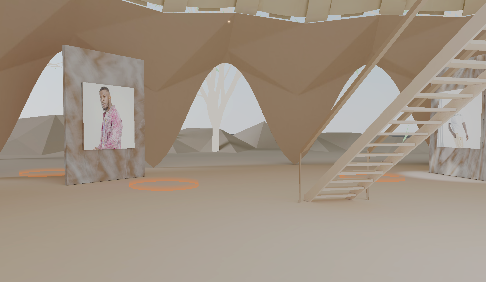

In this article I will explain how I made the hot zones in the [The Next Gallery](https://www.thenext.gallery/).

I wanted to create some hot zones in the gallery. But I thought it would be unnecessary to create a mesh for every creative in the gallery. By instancing the mesh, I would reduce the amount of draw calls a little and that’s always nice.

First I created a new class for the hot zones and added property `dummy` which is a 3D object which we will use later.


```tsx
import * as THREE from 'three'

export class HotZones {
  private dummy: THREE.Object3D

  constructor() {
    this.dummy = new THREE.Object3D()
  }
}
```

Next up, I created the cylinderGeometry geometry.


```tsx
import * as THREE from 'three'

export class HotZones {
  private dummy: THREE.Object3D
  private geometry: THREE.CylinderGeometry

  constructor() {
    this.dummy = new THREE.Object3D()
    this.geometry = new THREE.CylinderGeometry(1, 1, 0.3, 20, 5, true)
  }
}
```

For the material, I used a shader material to give my hot zone a little custom look. Because I want to use an instanced mesh, I need to use the `attribute mat4 instanceMatrix` to target the instances in my shader. You can read more about this on this [page](https://threejs.org/docs/#api/en/renderers/webgl/WebGLProgram).


```tsx
import * as THREE from 'three'

export class HotZones {
  private dummy: THREE.Object3D
  private geometry: THREE.CylinderGeometry
  private material: THREE.RawShaderMaterial

  constructor() {
    this.dummy = new THREE.Object3D()
    this.geometry = new THREE.CylinderGeometry(1, 1, 0.3, 20, 5, true)

    this.material = new THREE.RawShaderMaterial({
      vertexShader: `
      attribute vec3 position;
      attribute vec2 uv;
      attribute mat4 instanceMatrix;
      
      uniform mat4 projectionMatrix;
      uniform mat4 modelViewMatrix;

      varying vec2 v_uv;

      void main() {
        vec4 modelPosition = instanceMatrix * vec4(position, 1.0);
        vec4 projectionPosition = modelViewMatrix * modelPosition;

        gl_Position =  projectionMatrix * projectionPosition;
        v_uv = uv;
      }
      `,
      fragmentShader: `
      precision mediump float;

      varying vec2 v_uv;

      void main() {
        float strength = 1.0 - v_uv.y;
        vec3 color = vec3(0.95, 0.56, 0.295);
        gl_FragColor = vec4(color, strength);
      }
      `,
      transparent: true,
      side: THREE.DoubleSide
    })
  }
}
```


Now I can create the instanced mesh. The `THREE.InstancedMesh` class expects a geometry, a material and a count that tells three-js how many instances I need.


```tsx
import * as THREE from 'three'
import {creatives} from '../../../utils/metaData';

export class HotZones {
	private dummy: THREE.Object3D;
	private geometry: THREE.CylinderGeometry;
	private material: THREE.RawShaderMaterial;

	constructor() {
		this.dummy = new THREE.Object3D();

		...
		...

		this.mesh = new THREE.InstancedMesh(this.geometry, this.material, creatives.length);

	}
}
```

Now I created the instanced meshes. They still need to be added to the scene however. I added a parameter for the scene to the constructor of this class and added the mesh to the scene.


```tsx
import * as THREE from 'three'
import {creatives} from '../../../utils/metaData';

export class HotZones {
	private dummy: THREE.Object3D;
	private geometry: THREE.CylinderGeometry;
	private material: THREE.RawShaderMaterial;

	constructor(scene: THREE.Scene) {
		this.dummy = new THREE.Object3D();

		...
		...

		this.mesh = new THREE.InstancedMesh(this.geometry, this.material, creatives.length);

		scene.add(this.mesh);
	}
}
```

Now the mesh is added to our scene. But they all have the same position. I wanted the hot zones to have different coordinated. This is where the dummy comes into play.


The array `creatives` contains coordinates for every creative in the scene. I looped over every creative in this array and copied the coordinates of the creative, to the coordinates of the dummy.


After this I updated the matrix of the dummy and set a new matrix for a mesh instance.


```tsx
import * as THREE from 'three'
import {creatives} from '../../../utils/metaData';

export class HotZones {
	private dummy: THREE.Object3D;
	private geometry: THREE.CylinderGeometry;
	private material: THREE.RawShaderMaterial;

	constructor(scene: THREE.Scene) {
		this.dummy = new THREE.Object3D();

		...
		...

		this.mesh = new THREE.InstancedMesh(this.geometry, this.material, creatives.length);

		scene.add(this.mesh);

		creatives.forEach((creative, index) => {
      this.dummy.position.copy(creative.coordinates);
      this.dummy.updateMatrix();

      this.mesh.setMatrixAt(index, this.dummy.matrix);
    });
	}
}
```

That’s it! All the instances have their own position. But when you walk inside of a hot zone, nothing happens yet. I will explain how I created the collision event in the next article.

## Sources

[https://threejs.org/docs/#api/en/renderers/webgl/WebGLProgram](https://threejs.org/docs/#api/en/renderers/webgl/WebGLProgram)

[https://github.com/mrdoob/three.js/blob/master/examples/webgl_instancing_dynamic.html](https://github.com/mrdoob/three.js/blob/master/examples/webgl_instancing_dynamic.html)
