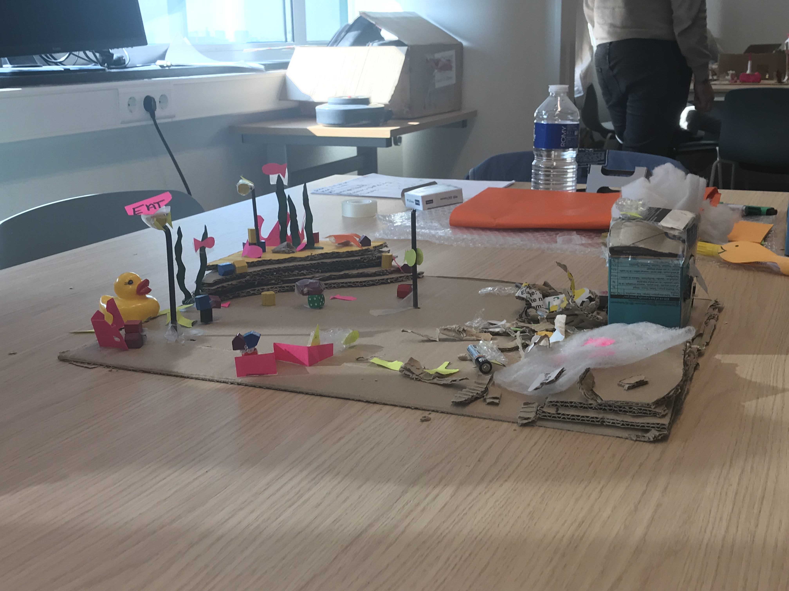
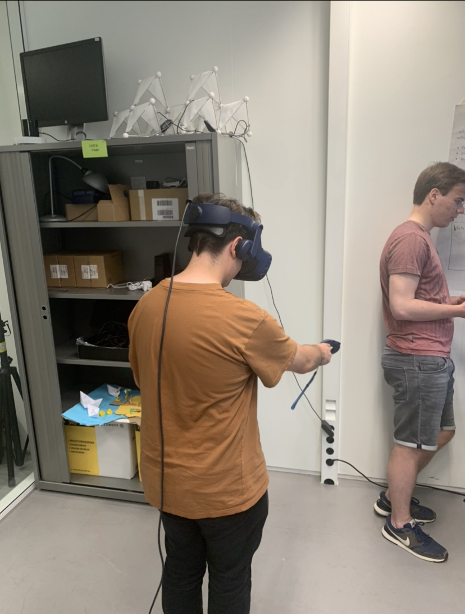
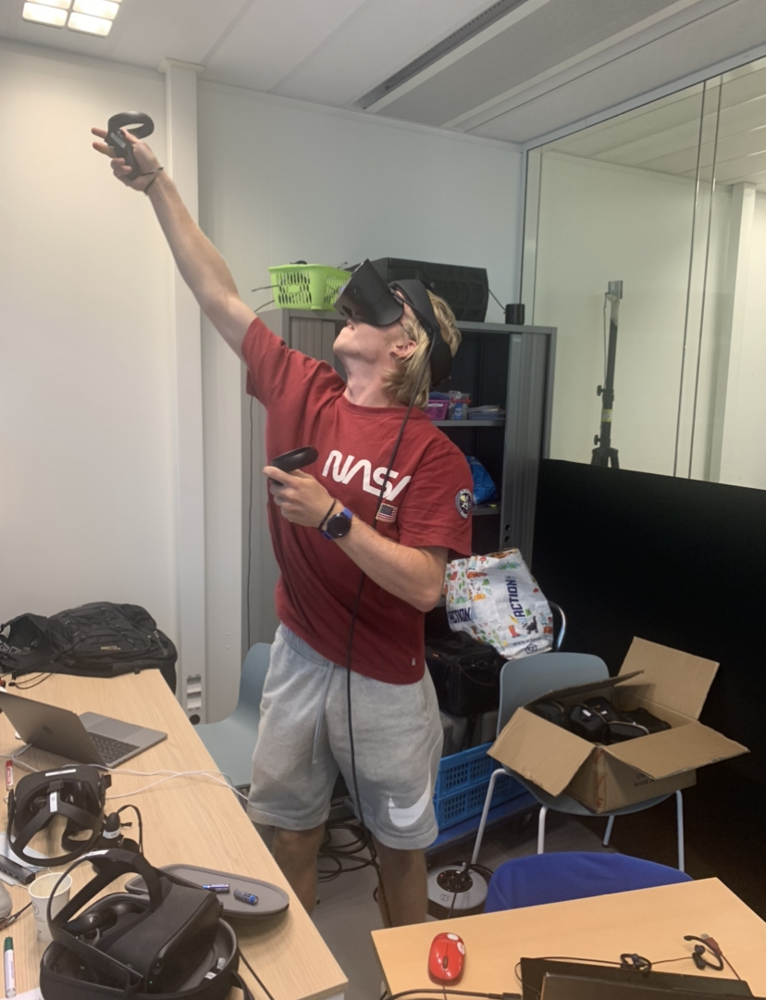
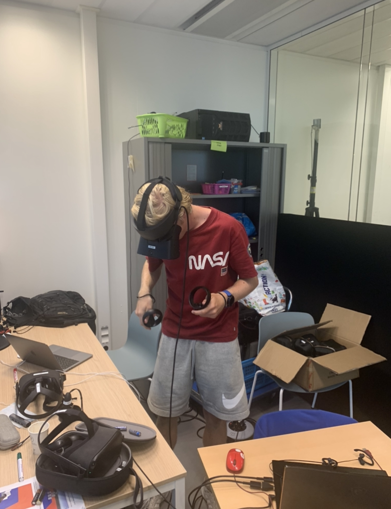

<h2>XR Testing</h2>

<h3>Brown boxing</h3>

Brown boxing is a fast and easy way to quickly prototype a concept. We used it to test our group game and to see if people would understand how to interact with the it

We got a lot of insides out of the brown box tests

<h3>White boxing</h3>

White boxing is common next step after brown boxing. In this stage of the project, we use tool to called Styly to create a VR scene really fast

For the white boxing assignment we could choose another project that we wanted to rapid prototype. So I chose te create a VR environment of a user that had to do different tasks in his house.

Because of the limitations of Styly, I couldn't test any interaction of this environment. I had to ask the test users how the would interact with the objects in the house and it resulted in some pretty cool insights.

<h3>Individual project</h3>

One of my goals was to make my game as realistic as possible. I wanted to test if users would interact with the game as if they were playing basketball on the court

I made a list of questions that I wanted to ask my test users

<ul>
    <li>Does the user know how to grab a basketball?</li>
    <li>Does user know when he scores?</li>
    <li>Does the user understand when the game is over?</li>
    <li>What can be added to make this game more challenging?</li>
</ul>

The tests gave some cool insights. Also because of the lack of time we had I couldn't create the game that I had in mind but it was still interesting to see how test users were playing my prototype

The user had to throw the ball with one hand, because of my lack of experience with Unity, I wasn't able to build a two-hand-grab mechanic. If I could continue with the game, this would be something I would implement.

<h3>Test conclusion</h3>

The game was not realistic of because of the bounce of the ball. Also because the player did not feel comfortable in the game because he was not able to move. The game was a little bit difficult to play but after a while it was fun.

If I would continue with this project, I would work on the bounciness of the ball and allow the user to move through the court

