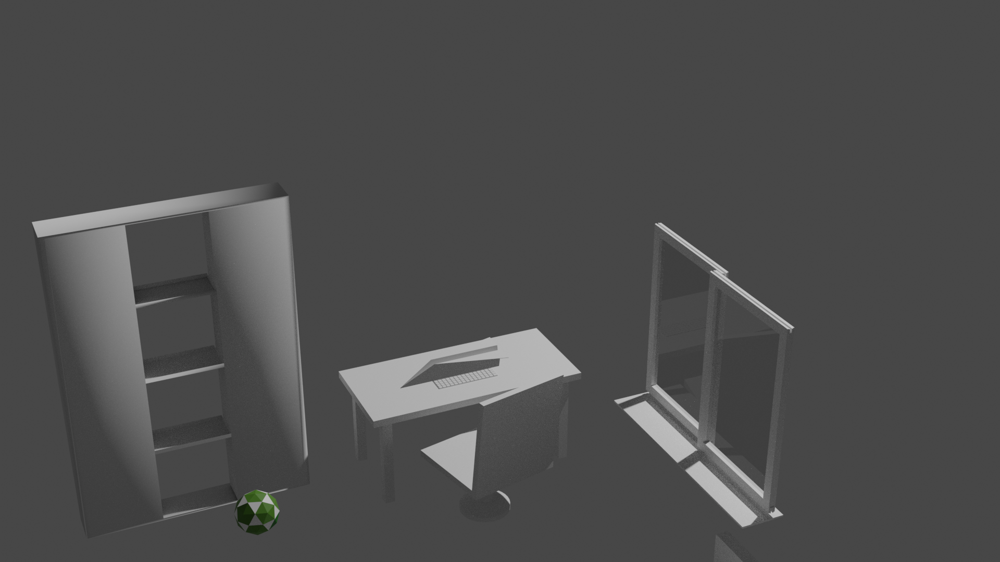
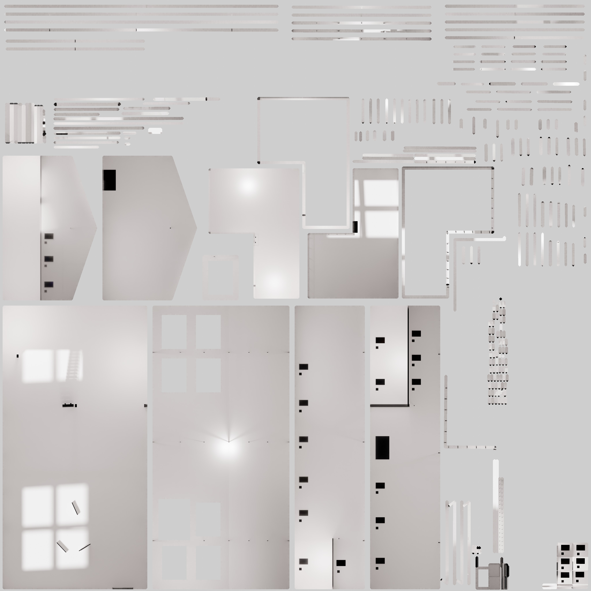
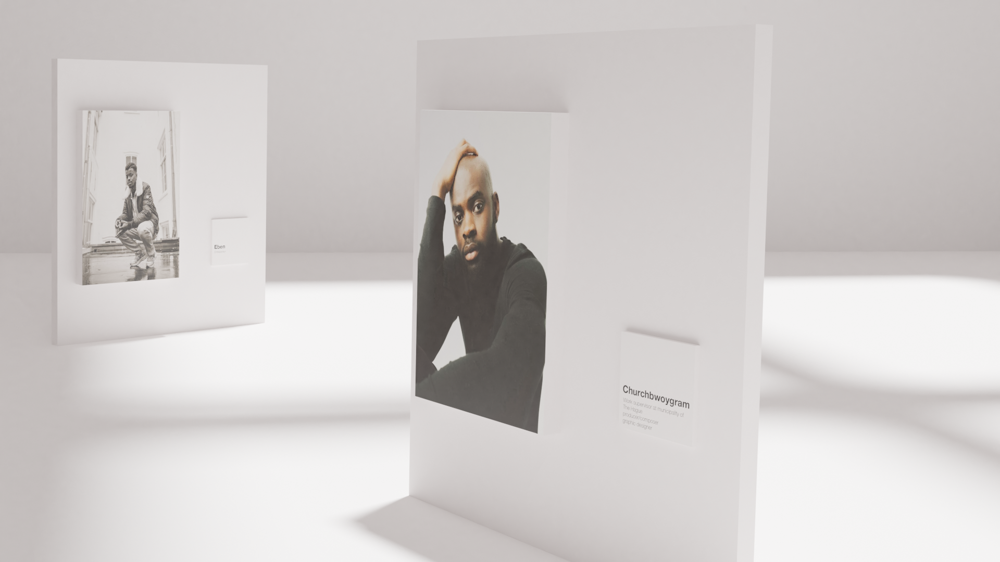

<h2>XR Assets</h2>

The second week of the pressure cooker, we had to create our own VR experience

<h3>Individual project</h3>

For my individual project I wanted to create all the assets by my self. As mastering Blender is something that is on my learning goals, I tried to focus on this and spend more time on finding efficient ways to build beatifull models

Creating the basket was a bit difficult but I think the result looks pretty good. Blender has some nice modifiers that made it easier to create the basket

<h3>Personal side project<h3/>

For my personal project I have finished the 3D model that I will use as my environment.

To optimize my model, I exprimented with baking textures into materials which turned out really nice

I asked 25 people if wanted to participate and result is looking really nice!

