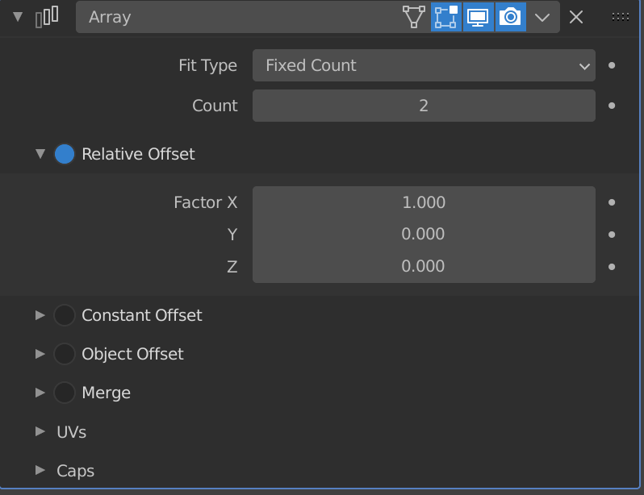
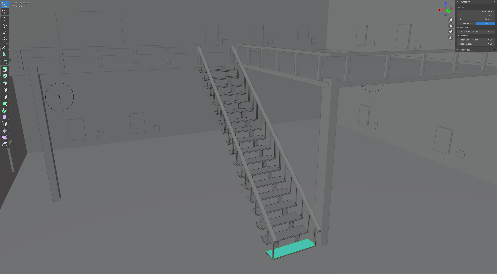
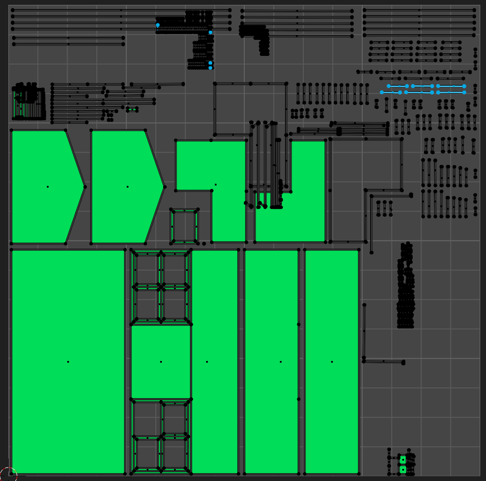
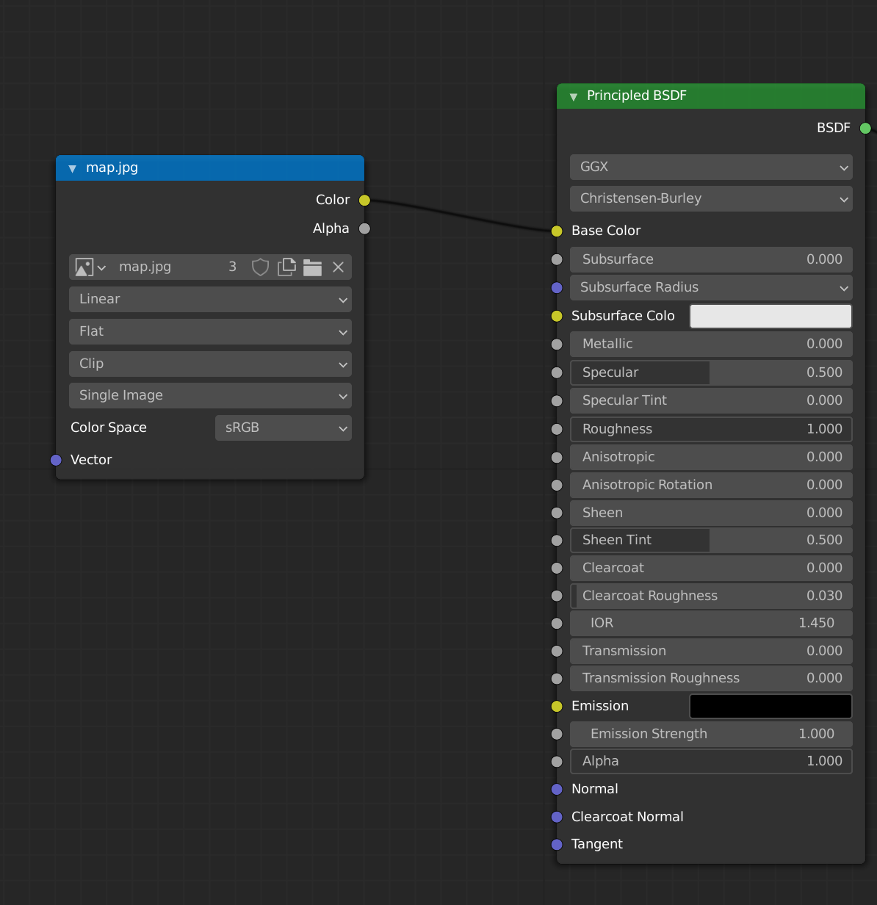
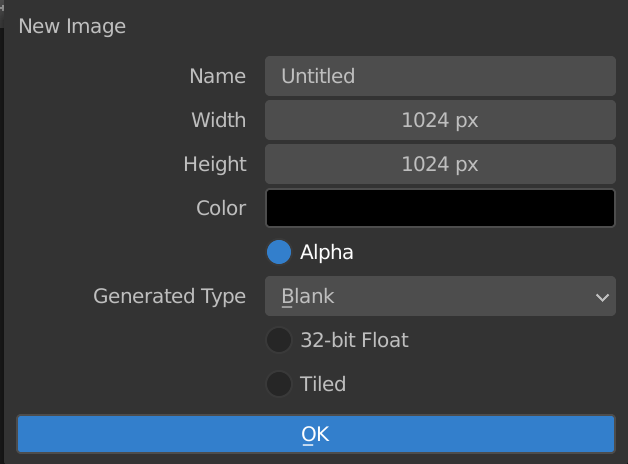
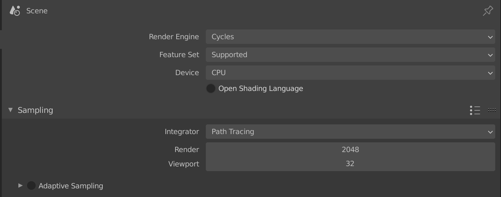

<h2>XR Assets</h2>

For our first sprint we had to create assets for our test scenes.

As we wanted to create some objects for in a room. I created a soccer, a closet and a paper plane. All objects were made out of one object by using loop cuts and extruding faces until I reached the result that I liked.

<h3>Individual project</h3>

As mastering Blender is something that is on my learning goals. I player around with some modifiers and I focused on spending more time on finding efficient ways to build beatifull looking models. 
I found a way to create beauftiful textures for my models called <em>baking</em> which I will explain and demonstrate later in this article.

<h4>Array modifier</h4>

For my museum I wanted to create some stairs so that the user would be able to explore the second floor. I found out that to create some stairs in blender, the array modifier is the perfect tool for that.

I started of with the first step, and the array modifier could copy that object an x amount of time and translate the coordinates for every object. That is perfect to create some stairs because every step you could change the coordinates to place the next step a little bit higher than the previous one.

Once you are done with your modifier, you should not forget to "apply" the modifier to your object. If you don't do this, the copies of your object will not exist.

<h4>Baking</h4>

Baking is a basically a technic that you can use to literally bake the texture from a render on an image, that you apply to your model in a game engine or in another environment of your preference.

I will demonstrate how I have used this baking technic for my 3D/VR experience on the web.

<h5>UV Unwrapping</h5>

To apply any kind of texture, it is essential to start of uv-unwrapping your model. In Blender, there is a cool option called "Smart UV Unwrap" that I used for my model.

Smart UV Unwrap is not as efficient as manually unwrapping your models. I would like to dive into manually unwrapping my models later this semester!

This is how the unwrap looked like. I made sure that there was enough space between the faces because during baking, the face fill have a small margin and I don't want them to overlap.

Now that my model is unwrapped. I can actually start with the baking process. First I created a new image. For the width and the heigth I used 4096 because I wanted good quality for my map.

I used as the generated type Blank and checked 32 bit-float option. This will make the texture data much more precise than a classic texture. I saved the texture as a .HDR file because hdr files contains the all the data from the texture and I want my texture to be almost the same as my render.

Next I added a image texture node in the shader editor. This way, I am telling Blender that this is the texture that I want all my objects to be baked on.

Next I set my render properties. I am using the cycles render as render engine and my sampling is on 2048, which might be a little too high but I just wanted to try it out and see how it would look like.

After baking all the objects, this is how the final map looked like:

<h3>Conclusion</h3>

I have learned some new tools and technics that I have not translated in our project yet, but were really usefull for my learning process! I could use these technics later in the semester in our group project.

