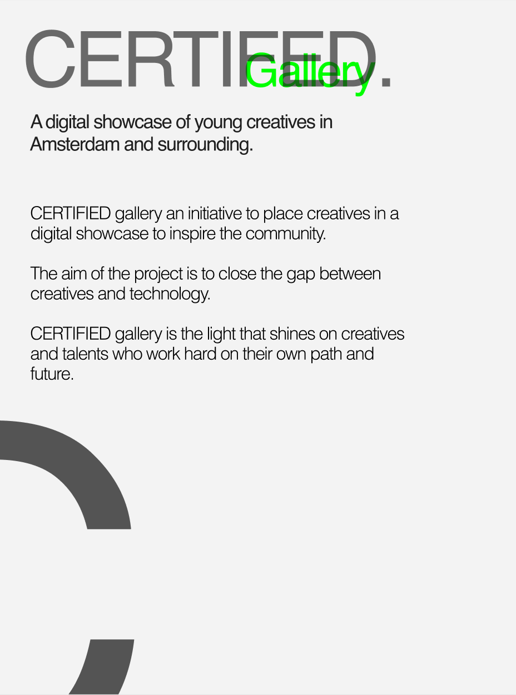

<h2>XR Concepting & Design</h2>

When a client from Specialisten net starts a procudure, they need to fill in a form. This form gives the therapist more information about the person and it gives an indication about whether the user is having any mental health issues. Our goal is to create a VR experience were we translate the questionaires into immersive VR experiences

For this sprint we wanted to see if we could actually translate some of the questions into good looking VR experience.
We created a concentration environment and a focus environment.

<h3>Personal side project</h3>

I also continued working on the concept of my personal project. The idea is that I want to close the gap between creatives in my environment and emerging technologies. I want to create an immersive gallery that showcases creatives and talents. The goal is to inspire creatives and talents to express themselves in innovative ways with technologies.

The experience will be an Augmented reality experience for mobile devices. There will also be an virtual reality experience available if you enter the website on your vr headset. The regular experience will be a immersive 3D experience web. The reason I am building this on the web is because the internet is accesible to everyone. And I want to reach as many people as possible.

The environment will be an museum. I chose this environment because people usually go to museum to get inspired. This is the same feeling I am trying to create. Minimalistic, a lot of light and bright colors and some good sound.

To challenge myself, I started the concepting for this side project as well. I wanted to implement the things that I was learning in the minor on a side-project that I am very passionate about.

