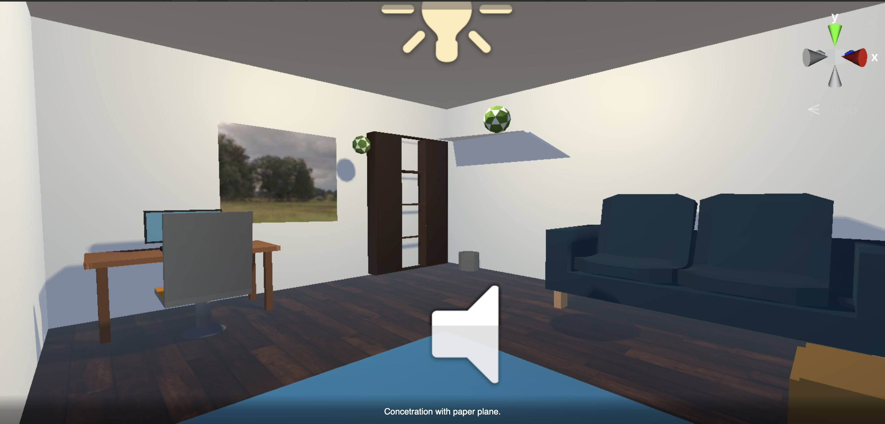

<h2>XR Development</h2>

For XR Development we had to create some mechanics for our prototype. I worked on creating some movement in the object that the user needs to follow in the concentration environment.



I wrote a small script that moves the focus the object into a few patterns.

```csharp

using System;
using System.Collections;
using System.Collections.Generic;
using UnityEngine;
using Valve.VR;
using Valve.VR.InteractionSystem;
using static System.Math;

public class focusObjectScript : MonoBehaviour
{

    public float amplitude;
    public float frequency;

    //If player is further than this distance, lookAtScore should return -1
    public float maximumDistance = 20;
    private float maximumDistanceSquared;

    private Transform playerTransform;

    Vector3 startPosition;

    private float x;
    private float y;
    private float z;

    [SerializeField] private Renderer renderer;

    private int frameCount;
    private float totalScore;

    // Start is called before the first frame update
    void Start()
    {
        startPosition = this.transform.position;
        if (Player.instance.hmdTransforms[0].gameObject.activeInHierarchy)
        {
            playerTransform = Player.instance.hmdTransforms[0];
        }
        else
        {
            playerTransform = Player.instance.hmdTransforms[1];
        }
        if(renderer == null)
            renderer = GetComponent<Renderer>();
        maximumDistanceSquared = maximumDistance * maximumDistance;
    }

    // Update is called once per frame
    void FixedUpdate()
    {
        if(Time.timeSinceLevelLoad > 3)
        {
            this.HandlePattern();
            float score = this.getLookAtScore();
            if (score > 0.95f)
            {
                renderer.material.color = Color.green;
            }
            else
            {
                renderer.material.color = Color.red;
            }

            totalScore += score;
            frameCount++;

            this.transform.position = new Vector3(x + startPosition.x, y + startPosition.y, z);
        }
    }

    void ReversedLinearPattern()
    {
        x = Mathf.Sin(Time.timeSinceLevelLoad * frequency) * amplitude;
        y = Mathf.Sin(5.0f * Time.time);
        z = transform.position.z;
    }

    void LinearPattern()
    {
        x = Mathf.Sin(5.0f * Time.time);
        y = Mathf.Sin(Time.timeSinceLevelLoad * frequency) * amplitude;
    }

    void CirclePattern()
    {
        x = Mathf.Sin(Time.timeSinceLevelLoad * frequency) * amplitude;
        y = Mathf.Cos(Time.timeSinceLevelLoad * frequency) * amplitude;
    }

    void KnotPattern()
    {
        x = Mathf.Sin(Time.timeSinceLevelLoad * frequency) * amplitude;
        y = Mathf.Cos(Time.timeSinceLevelLoad * frequency) * Mathf.Sin(Time.timeSinceLevelLoad * frequency) * amplitude;
    }

    void ReveredKnotPattern()
    {
        x = Mathf.Cos(Time.timeSinceLevelLoad * frequency) * Mathf.Sin(Time.timeSinceLevelLoad * frequency) * amplitude;
        y = Mathf.Sin(Time.timeSinceLevelLoad * frequency) * amplitude;
    }

    void HandlePattern()
    {

        if (Time.timeSinceLevelLoad < 10.0)
            this.ReversedLinearPattern();

        if (Time.timeSinceLevelLoad > 10.0 && Time.timeSinceLevelLoad < 30.0)
            this.LinearPattern();

        if (Time.timeSinceLevelLoad > 30.0 && Time.timeSinceLevelLoad < 40.0)
            this.CirclePattern();

        if (Time.timeSinceLevelLoad > 40.0 && Time.timeSinceLevelLoad < 50.0)
            this.KnotPattern();

        if (Time.timeSinceLevelLoad > 50.0)
            this.ReveredKnotPattern();
    }

    float getLookAtScore()
    {
        Vector3 playerToObject = this.transform.position - playerTransform.position;

        if(maximumDistance!=0 && playerToObject.sqrMagnitude > maximumDistanceSquared)
            return -1;

        playerToObject.Normalize();
        Vector3 lookDirection = playerTransform.forward;

        return Vector3.Dot(playerToObject, lookDirection);
    }

    private void OnMouseEnter()
    {
        renderer.material.color = Color.green;
    }

    private void OnMouseExit()
    {
        renderer.material.color = Color.red;
    }

    private void OnDestroy()
    {
        Debug.Log($"Plane in focus for {(totalScore/frameCount) * 100}% of the {(int) Time.timeSinceLevelLoad} seconds the player was in the scene");
    }
}
```
