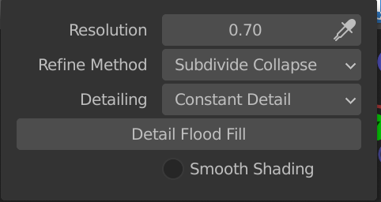

<h2>XR Assets</h2>

We were looking for ways to create more immersion and evoke relaxed and calm emotions with our environment.

Our testing results showed us that we were on a good way. But there was still some things we could improve.

One of testers suggested us to add some flowing water to our environment. This is something I tried to work on in the next sprint.

### Mood board

As usual, we started with a mood board. to get some inspiration. I realized whilst I was searching for inspiration that nice aesthetics in itself also evoke calm emotions. I did some more research on how nature impacts our wellbeing and I found an interesting explanation.

Being in nature, or even viewing scenes of nature, reduces anger, fear, and stress and increases pleasant feelings. Exposure to nature not only makes you feel better emotionally, it contributes to your physical wellbeing, reducing blood pressure, heart rate, muscle tension, and the production of stress hormones. (_How Does Nature Impact Our Wellbeing?_)

Because of this, I searched for more elements of nature. I searched specifically for mountains, hills, waterfalls.

This is the result of the mood board.

Once I had a good impression of how the new version of the environment was suppose to look like, I started modeling in Blender.

I started off with an icosphere.

I added 2 subdivisions to the sphere.

Next, I went into sculpt mode.

Inside sculpt mode, I turned on dynamic topology. And I edited the
detailing to constant detail. This way, the faces that I am changing
will always have the same details instead of relative.

I changed the resolution to create a low poly effect and also to lower the amount of vertices I make during sculpting.

The final result of the environment looked like this.

For the water in the environment, I created a plane and positioned so that a few parts would be visible.

At last I added the threes and rocks that I made to the environment!

### Testing

When I tested this environment out in unity, I noticed a few things:

- It was very difficult to walk in this environment with our current mechanic.
- There was no flat floor which meant that the ground would eventually appear in the hangar. That is not what we wanted
- For some testers, the mountains did not look as mountains, but more like hills.

### Fixes

The first thing I solved was to flatten the faces of the play area. I selected the faces that I wanted to even out and transformed the faces according the origin of the object.

To make sure that users could actually see the mountains as mountains and not as hills, I added more definition to the mountains by making them bigger and making the hills smaller. This way I created more contrast between surface and mountains. This helped in defining the mountains in the game.

to create the waterfall I basically started off with a plane and added some horizontal and vertical loop cuts to the plane.

The idea behind the waterfall is to add a shader to this geometry so I wanted to have a little more detail in the faces of the plane.

Next I used the subdivision surface to smoothen the plane out so that it looks more natural.

This is how the environment looked in unity.

### Conclusion

During the process I realized that I really love creating scenery in Blender. The scene looks pretty in cool in Unity and we haven't even added the shaders to our waterfalls yet. I can't wait to test this and make more iterations on the environment.

### Sources

Low Poly island in Blender tutorial - [https://www.youtube.com/watch?v=0lj643VmTsg](https://www.youtube.com/watch?v=0lj643VmTsg)

_How Does Nature Impact Our Wellbeing?_ (z.d.). Taking Charge of Your Health & Wellbeing. Geraadpleegd op 15 december 2021, van https://www.takingcharge.csh.umn.edu/how-does-nature-impact-our-wellbeing
