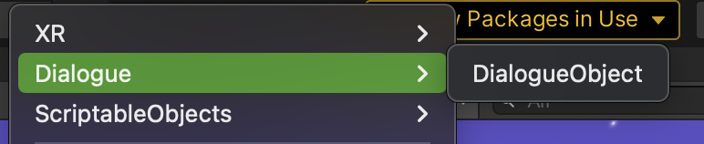
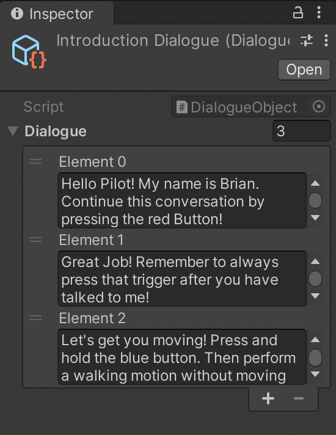
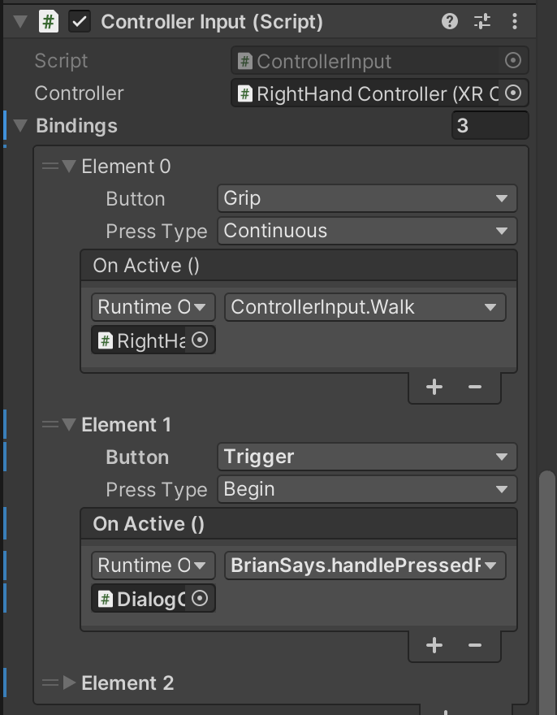

## XR Development

In our concept we opted for an assistant that helps the player get started in the experience. To communicate with the player, we have opted for a one-way dialogue system that allows the in-game assistant to tell the player what to do in the game.

I have researched a way to set up the dialogue system in the most efficient way possible. I came across a youtube tutorial that uses .assets that can have elements. Each element is a piece of text with instructions for the player in our case.

source: [Dialogue tutorial](https://www.youtube.com/playlist?list=PLCGaK2yqfY2IrJYnOnlgdmzWVUFXsRQXA)

We wanted to test what an easy way to guide the user through the dialogue. We chose to have the user click the primary A button to read the next message in the dialogue.

What I did first is made an option in the menu that creates a dialogue object.





The dialogue object is a scriptable object of type. Unity specifies that a ScriptableObject is a container that can hold large amounts of data.

In our case we only store the instructions in the dialogue objects. The object has only one property 'dialogue' which is an array of strings.

```csharp
using UnityEngine;

[CreateAssetMenu(menuName = "Dialogue/DialogueObject")]

public class DialogueObject : ScriptableObject
{
    [SerializeField] [TextArea] private string[] dialogue;

    public string[] Dialogue => dialogue;
}
```

Most of the logic is in the dialogue UI.

```csharp
using System.Collections;
using System.Collections.Generic;
using UnityEngine;
using TMPro;

public class BrianSays : MonoBehaviour
{
    [SerializeField] private GameObject dialogueBox;
    [SerializeField] private TMP_Text textlabel;
    [SerializeField] private StateMachine stateMachine;
    [SerializeField] private AudioSource source;
    [SerializeField] private AudioClip sound;

    private TypeWriter typeWriter;
    private bool isPressed = false;

    public DialogueObject playThis;

    public bool isOpen { get; private set; }

    void OnEnable()
    {

        this.source.PlayOneShot(this.sound);
        this.CloseDialogeBox();
        this.typeWriter = GetComponent<TypeWriter>();
        ShowDialogue(playThis);
    }

   public void ShowDialogue(DialogueObject dialogueObject)
    {
        this.isOpen = true;
        this.dialogueBox.SetActive(true);
        StartCoroutine(this.StepThroughDialogue(dialogueObject));
    }

   public IEnumerator StepThroughDialogue(DialogueObject dialogueObject)
    {
     for(int i = 0;  i < dialogueObject.Dialogue.Length; i++)
        {
            string dialogue = dialogueObject.Dialogue[i];

            yield return this.RunTypingEffect(dialogue);

            this.textlabel.text = dialogue;

            yield return null;
            yield return new WaitUntil(() => this.isPressed == true);
            this.isPressed = false;
        }

        this.CloseDialogeBox();
        this.gameObject.SetActive(false);
    }

    public void handlePressed()
    {
        this.isPressed = true;
    }

    private IEnumerator RunTypingEffect(string dialogue)
    {
        this.typeWriter.Run(dialogue, this.textlabel);

        while (this.typeWriter.isRunning)
        {
            yield return null;

            if(this.isPressed)
            {
                this.typeWriter.Stop();
            }
        }
    }

    public void CloseDialogeBox()
    {
        this.isOpen = false;
        this.dialogueBox.SetActive(false);
        this.textlabel.text = string.Empty;
    }

    private void OnDisable()
    {
        typeWriter.Stop();
        stateMachine.SwitchState(stateMachine.States[0]);
    }
}
```

Dialogue activator is the script I placed on box colliders in the game. This checks the collider with the box and if it is the correct collider, the state of the guide in the game (Brian) is set to speaking, and I set the correct dialogue object.

I noticed during testing that the dialogue object was triggered several times because I didn't remove the box colliders when they were no longer needed. I solved that with a simple fix that checks whether I should disable a gameObject.

```csharp
using UnityEngine;

public class DialogueActivator : MonoBehaviour
{

    [SerializeField] private DialogueObject dialogueObject;
    [SerializeField] private StateMachine brian;
    [SerializeField] private BrianSays speaker;
    [SerializeField] private Vector3 position;
    [SerializeField] private bool shouldDisable = true;

    private void OnTriggerEnter(Collider other)
    {
        if (other.CompareTag("Player") || other.CompareTag("Lever") || other.CompareTag("brokenPiece"))
        {
            brian.transform.position = position;
            Debug.Log("switchState");
            brian.SwitchState(brian.States[1]);

            this.speaker.playThis = dialogueObject;

				    if (shouldDisable)
            {
                this.gameObject.SetActive(false);
            }
        }
    }
}
```

I created the typewriter effect to improve the experience while reading. This script has a certain speed **typeWriterSpeed.** This property determines the speed of the effect.

Furthermore, there is a Readonly property Dictionary where certain characters are stored. A dictionary is actually a collection of value pairs.

I use the value pairs in the method **IsPunctuation** where I check if the character exists in the Dictionary and if so I wait for the **waitTime.**

```csharp
 private bool IsPunctuation(char charachter, out float waitTime)
    {
        foreach (KeyValuePair<HashSet<char>, float> punctuationCategory in this.punctuations)
        {
            if (punctuationCategory.Key.Contains(charachter))
            {
                waitTime = punctuationCategory.Value;
                return true;
            }
        }

        waitTime = default;
        return false;
    }
```

### Coroutine & IEnumerators

A Coroutine makes it possible to perform tasks across different frames. In Unity, a Coroutine can pause the execution of a method on a particular frame and transfer control to Unity and eventually resume on the correct frame.

```csharp
using System.Collections;
using System.Collections.Generic;
using UnityEngine;
using TMPro;

public class TypeWriter : MonoBehaviour
{

    [SerializeField]private float typeWriterSpeed = 50f;

    public bool isRunning { get;  private set; }

    private readonly Dictionary<HashSet<char>, float> punctuations = new Dictionary<HashSet<char>, float>()
    {
        {new HashSet<char>(){'.', ',', '!',}, 0.6f},
        {new HashSet<char>(){',', '-', ';', ':'}, 0.3f},
    };

    private Coroutine typeCoroutine;

    public void Run(string textToType, TMP_Text textLabel)
    {
       this.typeCoroutine = StartCoroutine(this.TypeText(textToType, textLabel));

    }

    public void Stop()
    {
        StopCoroutine(this.typeCoroutine);
        this.isRunning = false;
    }

    private IEnumerator TypeText(string textToType, TMP_Text textLabel)
    {
        this.isRunning = true;
        textLabel.text = string.Empty;

        float t = 0;
        int charIndex = 0;

        while(charIndex < textToType.Length)
        {
            int lastCharIndex = charIndex;

            t += Time.deltaTime * this.typeWriterSpeed;
            charIndex = Mathf.FloorToInt(t);
            charIndex = Mathf.Clamp(charIndex, 0, textToType.Length);

            for(int i = lastCharIndex; i < charIndex; i++)
            {
                bool isLast = i > textToType.Length - 1;

                textLabel.text = textToType.Substring(0, charIndex);

                if (this.IsPunctuation(textToType[i], out float waitTime) && !this.IsPunctuation(textToType[i + 1], out _))
                {
                    yield return new WaitForSeconds(waitTime);
                }
            }

            yield return null;
        }

        this.isRunning = false;
    }

    private bool IsPunctuation(char charachter, out float waitTime)
    {
        foreach (KeyValuePair<HashSet<char>, float> punctuationCategory in this.punctuations)
        {
            if (punctuationCategory.Key.Contains(charachter))
            {
                waitTime = punctuationCategory.Value;
                return true;
            }
        }

        waitTime = default;
        return false;
    }
}
```

### Interaction

The player can click through the dialogue at this point using the triggers.



### Conclusion

In this way we can easily invoke the dialogue in our Unity project. The dialogue is not only invoked when the player collides through a box, but also on other events such as completing the breathing exercise and completing a minigame. In these cases the dialogue is called in the following way.

```csharp
        [SerializeField] private DialogueObject dialogueObject;
        [SerializeField] private StateMachine brian;
        [SerializeField] private BrianSays speaker;

        ... some code
        ... some code

        brian.SwitchState(brian.States[1]);
        this.speaker.playThis = dialogueObject;
```

Creating a dialogue system was not something I wrote down as my learning goals. Still, I learned a lot from the process. It has also been of great benefit to us in our concept.

I'm glad I took the time to put this system together!
