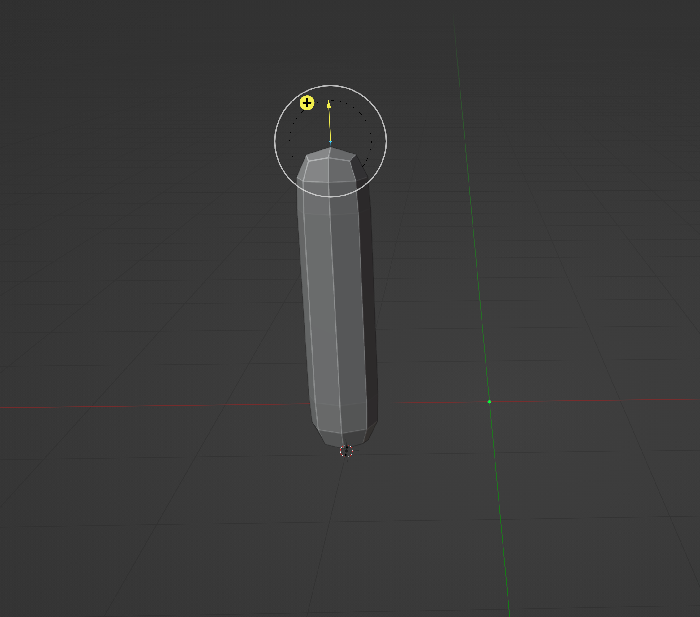
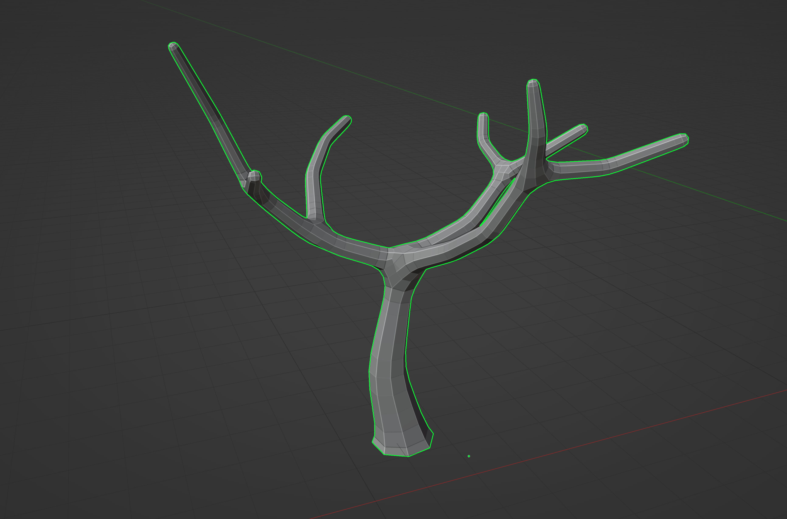
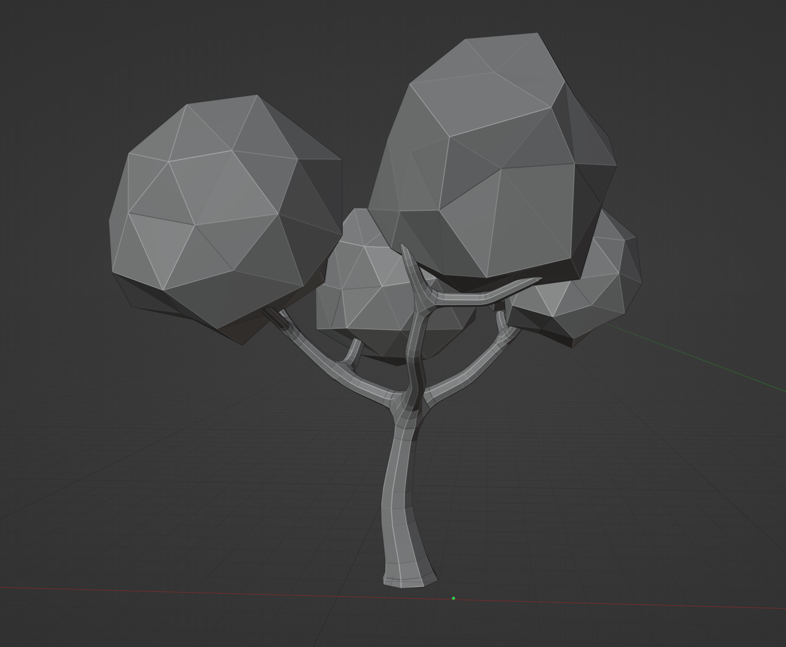
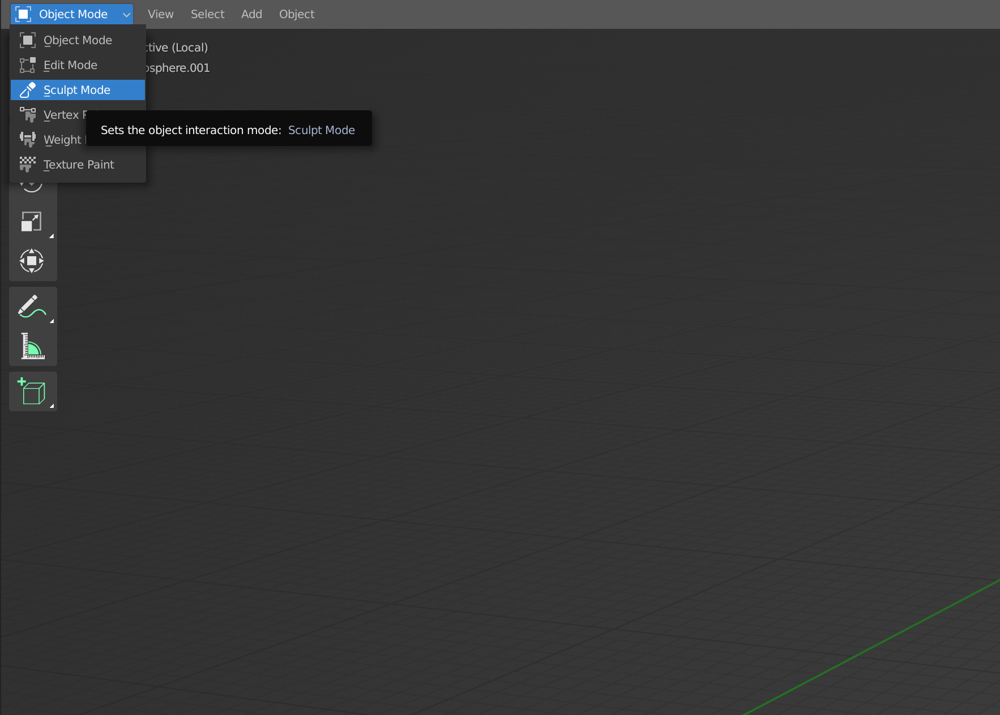
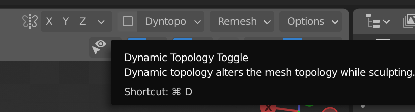
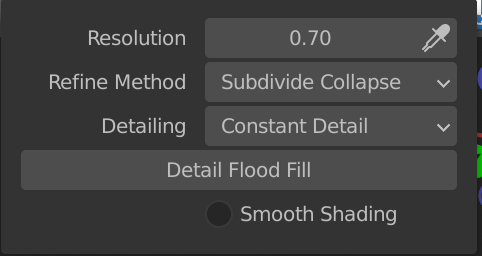

<h2>XR Assets</h2>

During this sprint I have been focusing on creating the environment and some assets for the environment.

<h3>Trees</h3>

For the trees, I started of with creating the branch. I started with a plane and removed three vertices of it, which would leave me with just one vertex.

I added two modifiers to the vertex. The first one is the skin modifier which would create a solid shape from vertices and edges using the radius of the single vertex.

After that I added the subdivision surface modifier to turn the faces into smaller parts.

I could make the branch bigger by extruding from the single vertex.

This approach made it very easy to create branches. I could just extrude a branch to any direction I wanted.

I created the leaves with Icospheres and added some randomness to the faces and scaling.

<h3>Rocks</h3>

The

<h3>Environments</h3>

I have been experimenting with creating environments in Blender using sculpting

I started of with an icosphere with 2 subdivisions.

Next, I went into sculpt mode.

Inside sculpt mode, I turned on dynamic topology. And I edited the detailing to constant detail. This way, the faces that I am changing will always have the same details instead of relative.

I changed the resolution to create a low poly effect and also to lower the amount of vertices I make during sculpting.

The final result of the environment looked like this.

For the water in the environment, I created a plane and positioned so that a few parts would be visible.

At last I added the threes and rocks that I made to the environment!

<h3>Conclusion</h3>

I have learned a lot of cool new technics that we used in our projects. I am starting to feel more and more comfortable in creating models in Blender!

