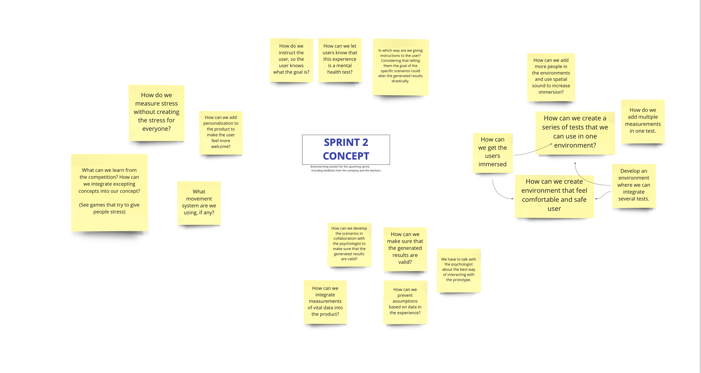
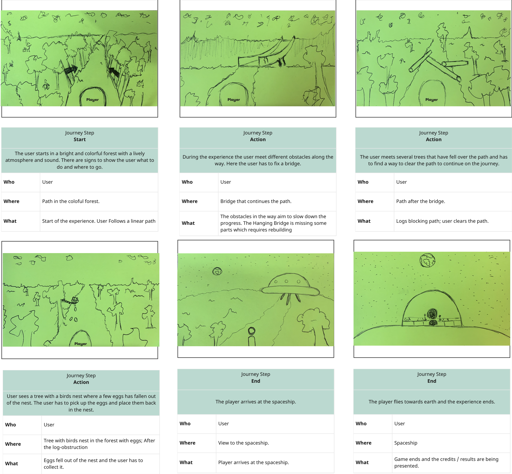
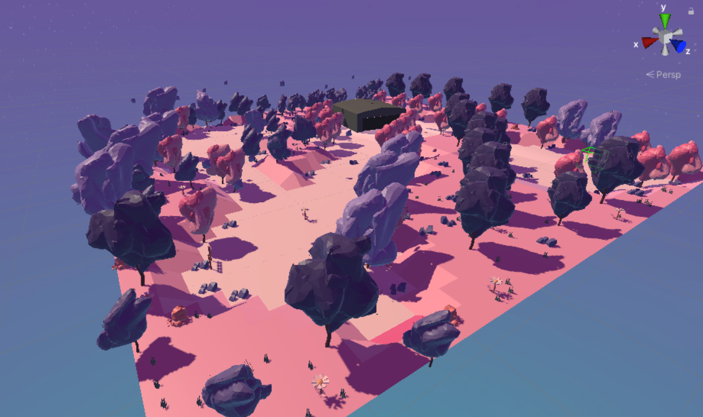

<h2>Concepting</h2>

After our tests from the last spring, we received some feedback about our concept. The goal for the user was not clear enough. After the feedback, we had some good brainstorm sessions about our concept.

We created a storyboard to visualize our concept on paper. 

A new concept with a clear story for the user. The user starts in a peaceful, colour and lively forest on a foreign planet. In the sky the user can see space, stars, planets etc. It should give the user a feeling of calm and comfort using the colour palette of SpecialistenNet. The forest forms a clear path in one direction. The goal of the game is for the user to get back to earth by getting to the spaceship. The user has to follow the path and along the way the user has to perform some tasks and will experience some things to get through the forest and to the spaceship, also to get the spaceship to work. When the user completes all the tasks he would be able to get the spaceship to fly back to earth. Tasks could also be implemented to the spaceship. The game will end with the spaceship flying back to earth.

I created a moodboard for our concept to give us a better understanding of how the game should look like. We want to evoke emotions such as happiness, calmth and relaxation. We added objects, shapes, and patterns that stimulate these emotions to our moodboard. We also tried to translate the color palette of our client in our moodboard.

<h3>Designing the environment</h3>

For the environment I started of with a plane and created a grid for this plane. I thought it would be nice to create a path on the plane with some hills so I changed the position of some of the vertices form a path on the plane. 

Some of our teammembers were busy with some cool models that we can use in our scene. We focused on creating trees, rocks, satallites the earth and much more.

I brought all the models together into one scene and this is the result

I have also been experimenting with different kind of scenes using scultping which I will talk about in the section assets.

