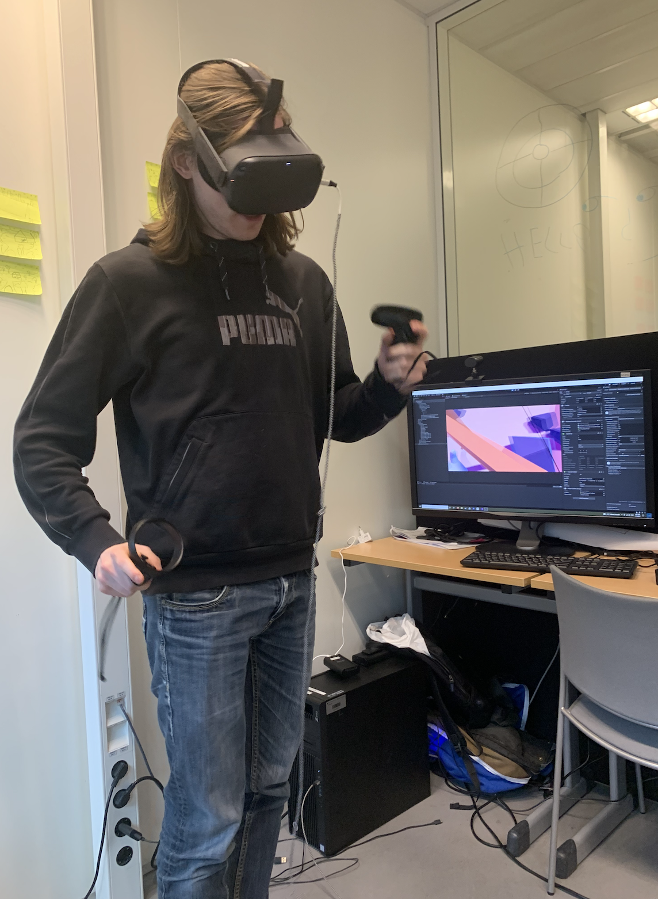
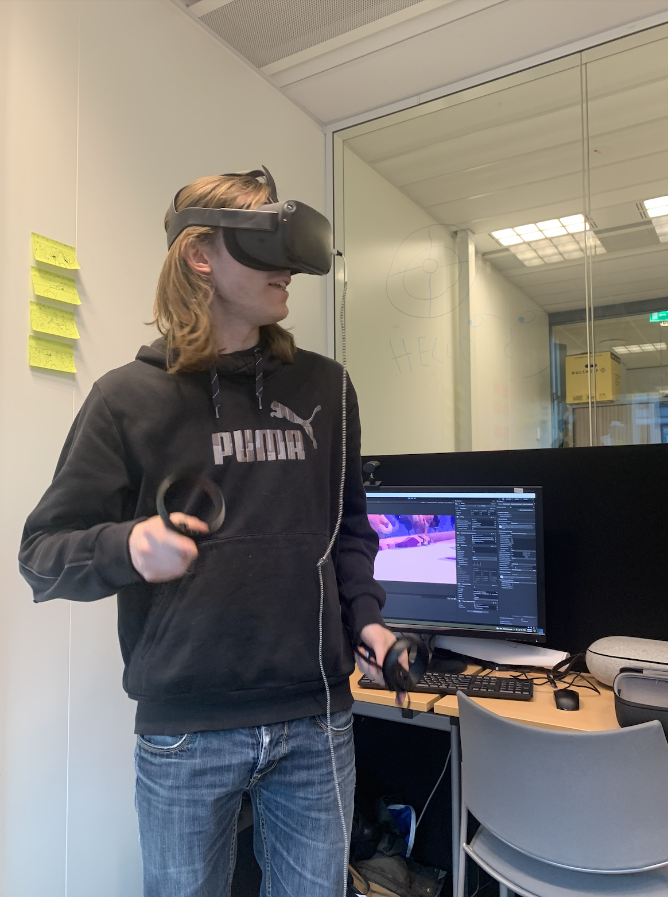
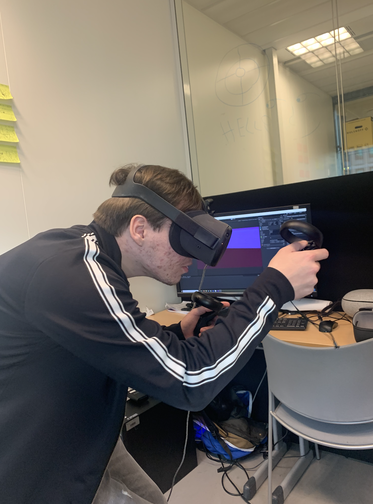

<h2>XR Testing</h2>

At the end of our second sprint we came up with a prototype that we could test with others. We created one environment were the user could performs one task.

<h3>Test questions</h3>
<ul>
<li>Does the user know where he is?</li>
<li>Does the environment evoke happy, calm relaxed emotions?</li>
<li>Are the mechanics easy to understand/use?</li>
<li>Is the minigame challenging enough?</li>
</ul>

For our test we focused a lot on the appearance of our experience. The look and feel of the forest had to be relaxed and soothing. We also wanted to test if our mechanics feel natural.
We received a lot of positive reactions on our mechanics. People really enjoyed our walking around.

We received a lot of feedback. The testers liked our environment but it took some time before most of the testers understood where they were. This was because the earth was hiding behind the trees. The space skybox was not clear enough for the users for them to understand that they were in space. We received feedback about the wooden signs that they were difficult to interact with.

Most of the testers did not see that the timer when the timer was running. It was not clear for them what it was suppose to do.

<h3>Conclusion</h3>
We realised after the sprint review that our concept was still not clear enough. We had an idea in mind where the user is in space and the goal for this user is to get back on earth. 
But we did not think about which minigames the user needs to perform. We started to early with modelling and development and we should have spent more time on concepting and design of our project.
