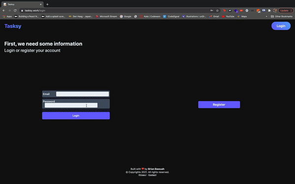

A task management tool for achievers
Get the most out of your day by tracking your daily tasks.


<h3>Concept</h3>
<p>Tasksy is a task management tool that can be used to keep track of your tasks.</p>
<p>The application is built in React, Node.js and Mongo DB
</p>
<br/>
<h3>Log in and register</h3>
<p>
Users can create an account and log in with their email address and password.
</p>
<p>
The login page and register page is designed with responsive enabling in mind.
</p>



<p>
On the page you can see the login and register button. When the user clicks a button, the corresponding form appears. When the user then clicks the other button, the form that was open shrinks and the correct button appears
</p>

The code of the login page

```javascript
import React, { Fragment, useEffect, useState, useRef } from 'react'
import swal from 'sweetalert'

import LoginForm from './smallComponents/user/LoginForm'
import RegisterForm from './smallComponents/user/RegisterForm'

const login = () => {
  const didUpdateRef = useRef(false)

  const [loginBool, setLoginBool] = useState(false)
  const [registerBool, setRegisterBool] = useState(false)
  ;('')

  const [registerDisplay, setRegisterDisplay] = useState('Register')
  const [loginDisplay, setLoginDisplay] = useState('Login')

  useEffect(() => {
    swal(
      'Cookies',
      'this application uses cookies to improve your experience',
      'info'
    )
  }, [])

  useEffect(() => {
    if (didUpdateRef.current) {
      if (!loginBool) {
        setTimeout(() => {
          setRegisterDisplay('')
          setLoginDisplay('Login')
        }, 1000)
      }

      if (!registerBool) {
        setTimeout(() => {
          setLoginDisplay('')
          setRegisterDisplay('Register')
        }, 1000)
      }
    } else didUpdateRef.current = true
  })

  return (
    <div className="login">
      <section>
        <h2 className="welcome-title">First, we need some information</h2>
        <p>Login or register your account</p>
      </section>
      <div className="form-container">
        <div
          className="button-wrapper"
          onClick={() => {
            setLoginBool(() => true)
            setRegisterBool(() => false)
          }}
        >
          {!loginBool && <h3>{loginDisplay}</h3>}
          <LoginForm bool={loginBool} />
        </div>

        <div
          className="button-wrapper"
          onClick={() => {
            setLoginBool(() => false)
            setRegisterBool(() => true)
          }}
        >
          {!registerBool && <h3>{registerDisplay}</h3>}
          <RegisterForm bool={registerBool} />
        </div>
      </div>
    </div>
  )
}

export default login
```

Login form

```javascript
import React, { useState, useContext, useRef } from 'react'
import { useTransition, useSpring, useChain, config } from 'react-spring'
import axios from 'axios'
import { useAuth } from '../../../context/auth'
import { useHistory } from 'react-router-dom'
// Ik importeer useHistory inplaats van Redirect want dit werkt voor mij

import { Container } from '../../../styles/styled-components/styles'

import { Context } from '../../../store/Store'

function LoginForm({ bool }) {
  const [isError, setIsError] = useState(false) //State does not change
  const [ingelogd, setIngelogd] = useState(false) //State does not change
  const [email, setEmail] = useState('')
  const [password, setPassword] = useState('')
  const { setAuthTokens } = useAuth()
  const [displayErr, setDisplayErr] = useState('')
  const history = useHistory()
  const [state, dispatch] = useContext(Context)

  // Submit handler
  function postLogin(e) {
    e.preventDefault()
    // Send user login to server
    // Om de CORS Policy te te enables, geef ik de header nieuwe properties mee
    let headers = new Headers()
    headers.append('credentials', 'include')

    // Post request naar server om in te loggen
    axios
      .post(
        `${process.env.API_URL}/users/login`,
        {
          email,
          password
        },
        {
          headers: headers
        }
      )
      .then((res) => {
        // Als server een status code van 200 terug stuurt
        if (res.status === 200) {
          // Zet dan de authTokens naar de res.data.token
          setAuthTokens(res.data.token)
          // Set de auth token als cookie
          document.cookie = `access_token=[${res.data.token}]; max-age=86400;`
          // Zet state van ingelogd naar true
          setIngelogd(true)
          // Zet state van isError naar false (ivm Error);
          setIsError(false)
          // Vertsuur de data van de user naar de global state
          // Zodat we die kunnen gebruiken in het dashboard
          dispatch({ type: 'SET_LOGIN', payload: true })
          dispatch({ type: 'SET_USER', payload: res.data.user })

          // console.log(res.data);

          history.push('/dashboard')
        } else {
          setIsError(true) //State does not change
          console.log(isError)
        }
      })
      .catch(({ response }) => {
        /*
        console.log(err) Werkt niet..
    
        Probleem is wanneer de console.log de error probeert je printen,
        de 'string represantion' geprint wordt. Niet de object structure,
    
        Dus de .response property is niet te zien.
          */
        setIsError(true) //State does not change
        console.log(isError)
        console.log(response.data.error)
        setDisplayErr(response.data.error)
        //Send back error from server
        console.log(displayErr)
      })
  }

  const springRef = useRef()

  const { size, opacity, ...rest } = useSpring({
    ref: springRef,
    config: config.stiff,
    from: { size: '50%', background: '#6C63FF', cursor: 'pointer' },
    to: {
      size: bool ? '100%' : '50%',
      background: bool ? 'rgba(0,0,0,0.0)' : '#6C63FF',
      cursor: bool ? 'default' : 'pointer'
    }
  })

  const transRef = useRef()
  const transitions = useTransition(bool ? '' : [], (item) => item.name, {
    ref: transRef,
    unique: true,
    trail: 100,
    from: { opacity: 0, transform: 'scale(0)' },
    enter: { opacity: 1, transform: 'scale(1)' },
    leave: { opacity: 0, transform: 'scale(0)' }
  })

  useChain(bool ? [springRef, transRef] : [transRef, springRef], [
    0,
    bool ? 0.1 : 0.6
  ])

  return (
    <Container style={{ ...rest, width: size }}>
      {transitions.map(({ key, props }) => (
        <form onSubmit={postLogin} key={key} style={{ ...props }}>
          <label>
            Email
            <input
              name="email"
              type="email"
              required={true}
              onChange={(e) => setEmail(e.target.value)}
            ></input>
          </label>

          <label>
            Password
            <input
              name="password"
              type="password"
              required={true}
              onChange={(e) => setPassword(e.target.value)}
            ></input>
          </label>

          <button type="submit">Login</button>
          {isError && <p className="error">{displayErr}</p>}
        </form>
      ))}
    </Container>
  )
}

export default LoginForm
```

Register form

```javascript
import React, { useState, useContext, useRef } from 'react'
import { useTransition, useSpring, useChain, config } from 'react-spring'
import axios from 'axios'
import { useAuth } from '../../../context/auth'
import { useHistory } from 'react-router-dom'

import { Container } from '../../../styles/styled-components/styles'

import { Context } from '../../../store/Store'

function RegisterForm({ bool }) {
  // State voor eventuele error bij foute password
  const [isError, setIsError] = useState(false)
  // State om te checken of gebruiker is ingelogdd
  const [ingelogd, setIngelogd] = useState(false)

  const [open, set] = useState(false)

  // State voor form gegevens
  const [email, setEmail] = useState('')
  const [passwordOne, setPasswordOne] = useState('')
  const [passwordTwo, setPasswordTwo] = useState('')
  const [name, setName] = useState('')
  const [age, setAge] = useState('')

  // Set the auth tokens naar localStorage
  const { setAuthTokens } = useAuth()
  // Displayen van evt error
  const [displayErr, setDisplayErr] = useState('')

  const history = useHistory()

  // Data versturen naar global state
  const [state, dispatch] = useContext(Context)

  // Submit handler
  function handleSubmit(e) {
    e.preventDefault()

    // Password check
    if (passwordOne !== passwordTwo) {
      setIsError(true)
      return setDisplayErr('Password does not match')
    }

    let headers = new Headers()
    headers.append('credentials', 'include')
    headers.append('Access-Control-Allow-Credentials', 'true')
    // Send user login to server
    axios
      .post(
        `${process.env.API_URL}/users`,
        {
          name: name,
          age: age,
          email: email,
          password: passwordOne
        },
        {
          headers: headers
        }
      )
      .then((res) => {
        if (res.status === 201) {
          // Zet dan de authTokens naar de res.data.token
          setAuthTokens(res.data.token)
          // Set de auth token als cookie
          document.cookie = `access_token=[${res.data.token}]; max-age=86400`
          // Zet state van ingelogd naar true
          setIngelogd(true)
          // Zet state van isError naar false (ivm Error);
          setIsError(false)

          // Vertsuur de data van de user naar de global state
          // Zodat we die kunnen gebruiken in het dashboard
          dispatch({ type: 'SET_LOGIN', payload: true })
          dispatch({ type: 'SET_USER', payload: res.data.user })
          // console.log(res.data);

          /*
          De gebruiker moet nog worden doorgestuurd
          naar de dashboard pagina
          */

          history.push('/dashboard')
        }
      })
      .catch(({ response }) => {
        setIsError(true) //State does not change
        console.log(isError)
        console.log(response.data.error)
        setDisplayErr(response.data.error)

        console.log(displayErr)
      })

    /*
    console.log(err) Werkt niet..
    Probleem is wanneer de console.log de error probeert je printen,
    de 'string represantion' geprint wordt. Niet de object structure,
    Dus de .response property is niet te zien.
      */
  }

  const springRef = useRef()

  const { size, opacity, ...rest } = useSpring({
    ref: springRef,
    config: config.stiff,
    from: { size: '50%', background: '#6C63FF', cursor: 'pointer' },
    to: {
      size: bool ? '100%' : '50%',
      background: bool ? 'rgba(0,0,0,0.0)' : '#6C63FF',
      cursor: bool ? 'default' : 'pointer'
    }
  })

  const transRef = useRef()
  const transitions = useTransition(bool ? '' : [], (item) => item.name, {
    ref: transRef,
    unique: true,
    trail: 100,
    from: { opacity: 0, transform: 'scale(0)' },
    enter: { opacity: 1, transform: 'scale(1)' },
    leave: { opacity: 0, transform: 'scale(0)' }
  })

  useChain(bool ? [springRef, transRef] : [transRef, springRef], [
    0,
    bool ? 0.1 : 0.6
  ])

  return (
    <Container style={{ ...rest, width: size }}>
      {transitions.map(({ key, props }) => (
        <form onSubmit={handleSubmit} key={key} style={{ ...props }}>
          <label>
            Name
            <input
              required={true}
              name="name"
              type="text"
              onChange={(e) => setName(e.target.value)}
            ></input>
          </label>

          <label>
            Age
            <input
              name="age"
              type="number"
              onChange={(e) => setAge(e.target.value)}
            ></input>
          </label>

          <label>
            Email
            <input
              required={true}
              name="email"
              type="email"
              onChange={(e) => setEmail(e.target.value)}
            ></input>
          </label>

          <label>
            Password
            <input
              required={true}
              name="password-one"
              type="password"
              onChange={(e) => setPasswordOne(e.target.value)}
            ></input>
          </label>

          <label>
            Password
            <input
              required={true}
              name="password-two"
              type="password"
              onChange={(e) => setPasswordTwo(e.target.value)}
            ></input>
          </label>
          <button type="submit">Register</button>
          {isError && <p className="error">{displayErr}</p>}
        </form>
      ))}
    </Container>
  )
}

export default RegisterForm
```

<p>
The dashboard allows the user to add and delete tasks. The user can also edit his profile and add a profile picture to personalize his environment
</p>

<p>
You can view the code of the server <a href="https://github.com/bbawuah/Tasksy-api"  target="__blank">here</a>. 
</p>
<p>
You can view the code of the frontend <a href="https://github.com/bbawuah/Tasksy-ui"  target="__blank">here</a>. 
</p>
<p>
You can view the project <a href="https://www.tasksy.work/"  target="__blank">here</a>. 
</p>

<h3>Wanna know more? Let's chat!</h3>
<p>These are just some code snippets. Do you know more about this app? Send me a message! I would love to talk code and learn from others :)</p>

<p>Thanks for reading!</p>
