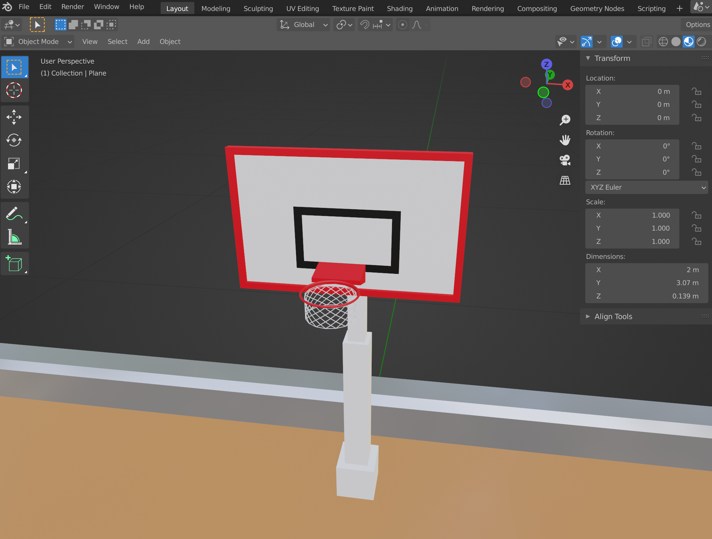
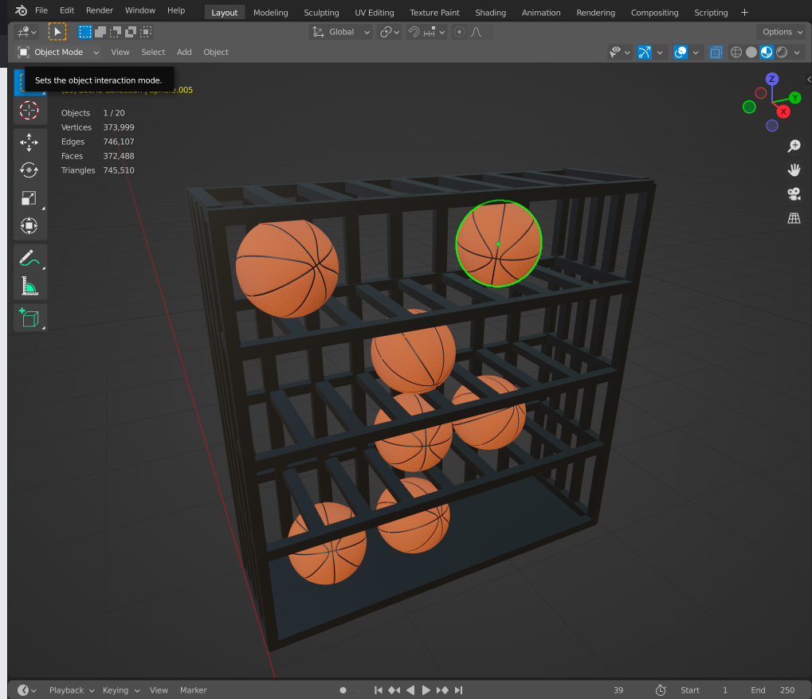
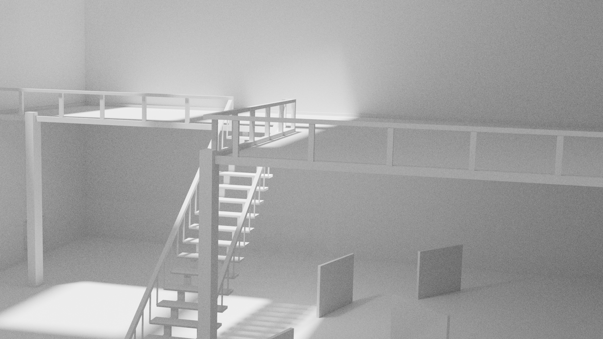

<h2>XR Assets</h2>

The second week of the pressure cooker, we had to create our own VR experience

<h3>Individual project</h3>

For my individual project I wanted to create all the assets by my self. As mastering Blender is something that is on my learning goals, I tried to focus on this and spend more time on finding efficient ways to build beatifull models

Creating the basket was a bit difficult but I think the result looks pretty good. Blender has some nice modifiers that made it easier to create the basket

I also created some balls to play, which were not that difficult to make

<h3>Personal side project<h3/>

For my personal project I wanted to build a museum in Blender. Because I want to use this model on the web, it needs to be as optimized as much as possible to give the user a good experience 

I spend a lot of time working on a 3D museum for my personal project

