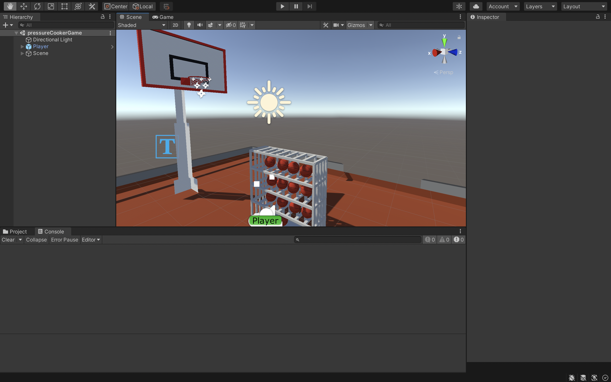

<h2>XR Development</h2>

For XR Development we had to use Unity. As a webdeveloper, I enjoy coding and I am not afraid to try out new techonologies and programming languages. Although Unity development is not something I want to focus on too much, I experimented with some cool components and wrote my own script to personalize my game.



I wrote a small script that checks when a ball goes through the hoop. When a user scores, the user should see a particle effect and the position of the ball should be reset to the initial ball position.

```csharp
public class ScoreArea : MonoBehaviour
{
    public GameObject ball;
    public Vector3 originalBallPosition;
    public GameObject scoreText;

    void Start() {

        originalBallPosition = ball.GetComponent < Ball >().transform.position;
    }

    void OnTriggerEnter(Collider otherCollider) {


    if(otherCollider.tag == "ball") {
        Debug.Log("You scored");
        this.GetComponent<ParticleSystem>().Play();

        var scoreComponent = GameObject.FindWithTag("scoreText");
        scoreComponent.GetComponent<ScoreText>().addPoints();

        if(otherCollider.attachedRigidbody) {
                otherCollider.attachedRigidbody.useGravity = false;
                otherCollider.transform.position = originalBallPosition;
                otherCollider.attachedRigidbody.useGravity = true;
            }


        }
    }
}
```
